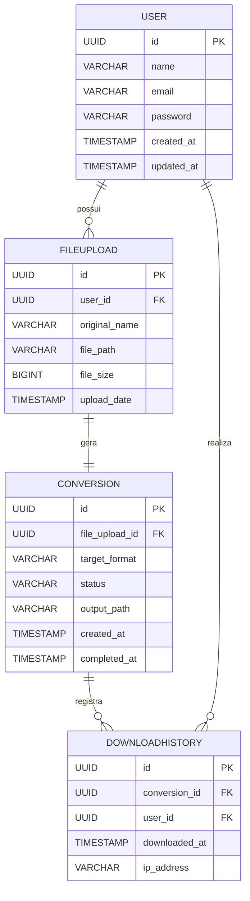

# Modelo de Dados (ERD)

## **1. Visão Geral**

O **modelo de dados** define as principais entidades, atributos e relacionamentos necessários para o funcionamento do sistema de conversão de arquivos.

O objetivo é garantir a consistência entre o backend (Spring Boot), o banco de dados (PostgreSQL) e a API REST definida anteriormente.

O sistema possui quatro entidades principais:

1. **User** — Representa o usuário autenticado.
2. **FileUpload** — Armazena informações sobre o arquivo enviado para conversão.
3. **Conversion** — Registra o processo de conversão e seus resultados.
4. **DownloadHistory** — Armazena registros de downloads realizados pelo usuário.

---

## **2. Diagrama Entidade-Relacionamento (ERD)**

---

## **3. Descrição das Entidades**

### **User**

| Campo | Tipo | Descrição |
| --- | --- | --- |
| id | UUID | Identificador único do usuário |
| name | VARCHAR(100) | Nome do usuário |
| email | VARCHAR(150) | E-mail único (usado na autenticação) |
| password | VARCHAR(255) | Senha criptografada (BCrypt) |
| created_at | TIMESTAMP | Data de criação do registro |
| updated_at | TIMESTAMP | Última atualização do registro |

---

### **FileUpload**

| Campo | Tipo | Descrição |
| --- | --- | --- |
| id | UUID | Identificador único do upload |
| user_id | UUID | Referência ao usuário que fez o upload |
| original_name | VARCHAR(200) | Nome original do arquivo enviado |
| file_path | VARCHAR(255) | Caminho completo do arquivo temporário |
| file_size | BIGINT | Tamanho do arquivo em bytes |
| upload_date | TIMESTAMP | Data e hora do upload |

---

### **Conversion**

| Campo | Tipo | Descrição |
| --- | --- | --- |
| id | UUID | Identificador único da conversão |
| file_upload_id | UUID | Referência ao arquivo enviado |
| target_format | VARCHAR(10) | Tipo de conversão (ex: `PDF`, `DOCX`, etc.) |
| status | ENUM | Estado atual (`PENDING`, `SUCCESS`, `FAILURE`) |
| output_path | VARCHAR(255) | Caminho do arquivo convertido |
| created_at | TIMESTAMP | Data de início da conversão |
| completed_at | TIMESTAMP | Data de finalização da conversão |

---

### **DownloadHistory**

| Campo | Tipo | Descrição |
| --- | --- | --- |
| id | UUID | Identificador do registro de download |
| conversion_id | UUID | Referência ao arquivo convertido |
| user_id | UUID | Usuário que realizou o download |
| downloaded_at | TIMESTAMP | Data e hora do download |
| ip_address | VARCHAR(45) | Endereço IP do usuário no momento do download |

---

## **4. Relacionamentos**

| Relacionamento | Tipo | Descrição |
| --- | --- | --- |
| User → FileUpload | 1:N | Um usuário pode enviar vários arquivos |
| FileUpload → Conversion | 1:1 | Cada arquivo enviado gera uma conversão |
| Conversion → DownloadHistory | 1:N | Cada conversão pode ser baixada várias vezes |
| User → DownloadHistory | 1:N | Cada usuário pode baixar vários arquivos convertidos |

---

## **5. Observações Técnicas**

- Todas as chaves primárias usarão o tipo **UUID** (para segurança e compatibilidade com sistemas distribuídos).
- O **status** da conversão usará um `ENUM` ou `VARCHAR CHECK`, dependendo da compatibilidade do PostgreSQL configurado.
- A pasta de armazenamento temporário será mapeada para `/tmp/uploads` (configurável via `application.yml`).
- A limpeza automática de arquivos expirados será feita via **Spring Scheduler**.
- O relacionamento `FileUpload` → `Conversion` é **1:1**, pois um upload gera exatamente uma conversão por vez no MVP.

